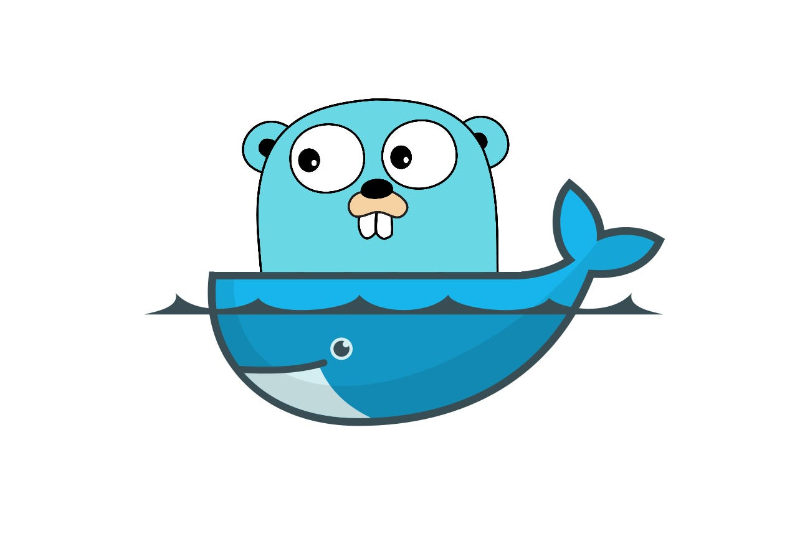

# ⭐ Desafio Dokcer Golang
Esse desafio é muito empolgante principalmente se você nunca trabalhou com a linguagem Go!

### 📝 Regras:

1. Você terá que publicar uma imagem no docker hub.
2. Quando executarmos:  
```
docker run isaqueamorim/fullcycle
```
temos que ter o seguinte resultado: Full Cycle Rocks!!

3. A imagem de nosso projeto Go precisa ter menos de 2MB.

### 🌐 Link DockerHub: 
> https://hub.docker.com/repository/docker/isaqueamorim/fullcycle/general
